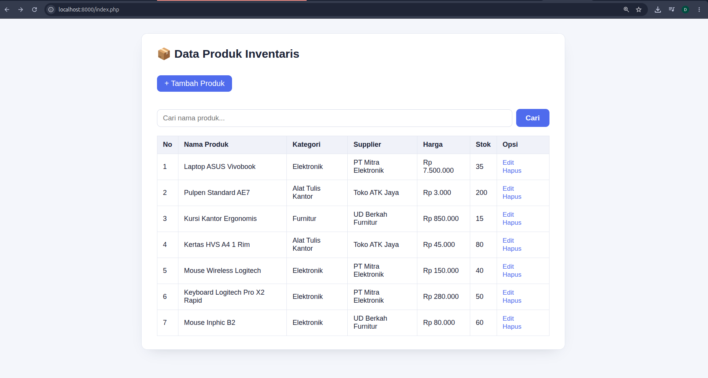
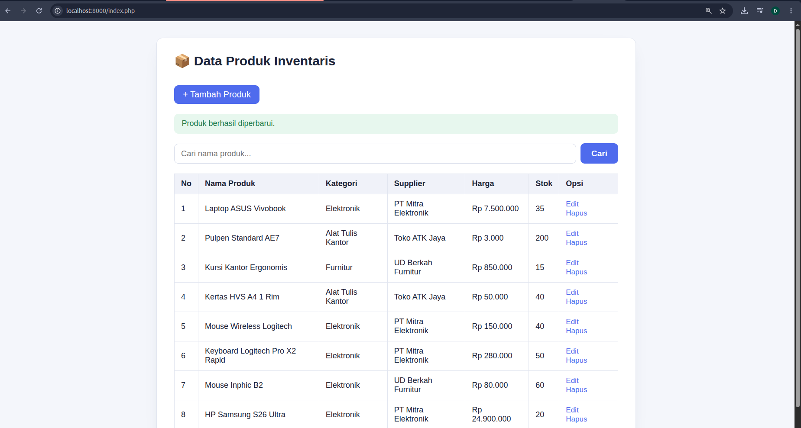
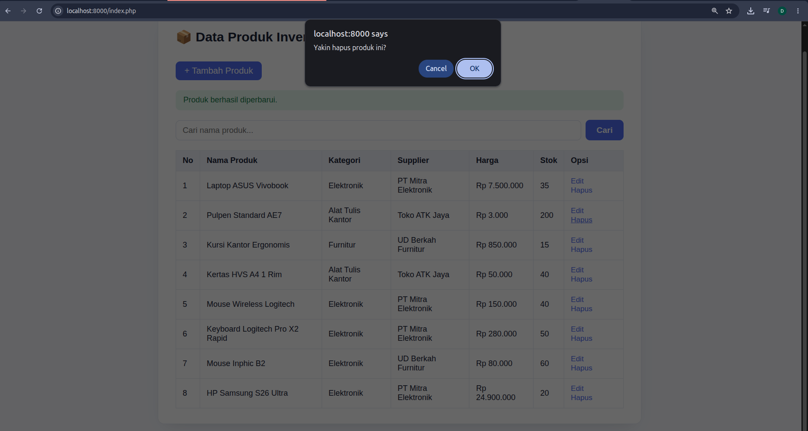
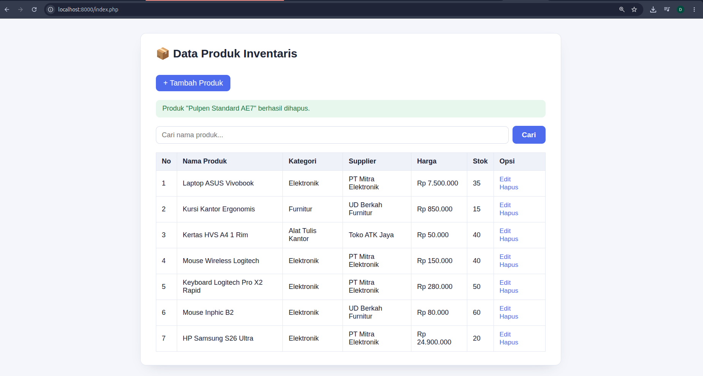

# CRUD Inventaris

Tugas Rutin 8 — Pemrograman Web (3KOM40115) — PHP Intermediet (CRUD)

Aplikasi CRUD produk inventaris pakai PHP native + PDO (Singleton pattern) + MySQL, dengan 3 tabel relasional (`kategori`, `supplier`, `produk`) yang saling terhubung lewat foreign key.

## 🛠️ Cara menjalankan (XAMPP)

1. Install [XAMPP](https://www.apachefriends.org/) kalau belum ada, nyalakan **Apache** dan **MySQL** dari XAMPP Control Panel.
2. Import database. Pilih salah satu cara:
   - **Lewat phpMyAdmin** (`http://localhost/phpmyadmin`): klik tab **SQL**, copy-paste seluruh isi `schema.sql`, klik **Go**. Database `inventaris_db` beserta isinya otomatis dibuat.
   - **Lewat terminal**: `mysql -u root -p < schema.sql`
3. Copy seluruh folder ini ke `htdocs`:
   - Windows: `C:\xampp\htdocs\TugasWeb-Pertemuan8-CRUD\`
   - Linux: `/opt/lampp/htdocs/TugasWeb-Pertemuan8-CRUD/`
4. Buka browser ke `http://localhost/TugasWeb-Pertemuan8-CRUD/`

Kalau pakai `php -S` langsung (tanpa XAMPP/Apache) juga bisa, asal MySQL-nya tetap jalan (lewat XAMPP atau service MySQL lain) dan `koneksi.php` bisa menjangkau `localhost:3306`.

## 📸 Screenshot aplikasi

### Halaman List Produk & Pencarian
![List Produk] 

### Form Tambah Produk
![Tambah Produk] 

### Form Edit Produk
![Edit Produk]

### Form Hapus Produk 
![Tambah Produk]  

## ✅ Requirement yang dipenuhi

1. [x] Database `inventaris_db` dengan 3 tabel + FK — `kategori`, `supplier`, `produk` (`produk.kategori_id` dan `produk.supplier_id` sebagai foreign key)
2. [x] Minimal 5 data seed per tabel — 5 kategori, 5 supplier, 6 produk (lihat `schema.sql`)
3. [x] Koneksi PDO dengan Singleton pattern — class `Database` di `koneksi.php`, constructor privat + `getInstance()`
4. [x] Halaman list produk dengan JOIN 2 tabel — `index.php` JOIN `produk` ke `kategori` **dan** `supplier` sekaligus
5. [x] Form create dengan dropdown kategori & supplier — `tambah.php`, opsinya diambil langsung dari database
6. [x] Fitur update (form pre-filled) & delete (konfirmasi) — `edit.php`/`update.php`, dan `hapus.php` dengan `confirm()` di JavaScript
7. [x] SEMUA query input pakai prepared statements — tidak ada satu pun query yang menempel variabel langsung ke string SQL
8. [x] Output HTML pakai `htmlspecialchars()` — di semua tempat yang menampilkan data dari database
9. [x] Flash message sukses/gagal (redirect pattern) — lewat `$_SESSION` di `flash.php`, tampil sekali lalu otomatis hilang
10. [x] UI rapi — `style.css` konsisten dengan tugas-tugas sebelumnya

## ⭐ Fitur bonus

- [x] **Transaction pada delete + log aktivitas** — `hapus.php` membungkus proses hapus produk dan pencatatan ke tabel `log_aktivitas` dalam satu `beginTransaction()`/`commit()`/`rollBack()`, jadi kalau salah satu gagal, keduanya dibatalkan (tidak ada data yang "setengah tersimpan")
- [x] **Fitur pencarian** — kolom cari di `index.php`, filter nama produk pakai `LIKE` (tetap prepared statement, aman dari SQL Injection)

## 📁 Struktur file

```
TugasWeb-Pertemuan8-CRUD/
├── koneksi.php       ← koneksi PDO Singleton
├── flash.php         ← helper flash message (session)
├── index.php         ← READ: list produk (JOIN) + pencarian
├── tambah.php        ← form tambah produk
├── tambah_aksi.php   ← CREATE: proses simpan produk baru
├── edit.php          ← form edit (data lama + dropdown pre-selected)
├── update.php        ← UPDATE: proses simpan perubahan
├── hapus.php         ← DELETE: hapus produk + transaction + log
├── style.css
├── schema.sql        ← database, tabel, foreign key, seed data
└── README.md
```

## 📸 Screenshot aplikasi

> Bagian ini perlu diisi sendiri — saya tidak punya PHP+MySQL untuk menjalankan aplikasinya secara langsung, jadi tidak bisa mengambil screenshot dari sini. Setelah dijalankan di komputermu, tambahkan screenshot di bawah ini sebelum di-push (drag screenshot ke README.md di GitHub, atau simpan sebagai file gambar di folder ini lalu link-kan).

- [ ] Screenshot halaman list produk (`index.php`)
- [ ] Screenshot form tambah produk
- [ ] Screenshot form edit produk
- [ ] Screenshot flash message setelah tambah/edit/hapus

## 🔒 Catatan keamanan

`koneksi.php` pakai user `root` tanpa password — standar bawaan XAMPP untuk development lokal. **Jangan pernah dipakai apa adanya di server publik/production** — di situ mestinya pakai user MySQL khusus dengan password dan hak akses terbatas.

## 🐙 Cara push ke GitHub

```bash
git init
git add .
git commit -m "Tugas Rutin 8: CRUD Inventaris"
git branch -M main
git remote add origin https://github.com/<username>/TugasWeb-Pertemuan8-CRUD.git
git push -u origin main
```

Pastikan repository dibuat dengan nama persis `TugasWeb-Pertemuan8-CRUD`, visibility **Public**, dan `schema.sql` ikut ter-push. Setelah itu, tambahkan screenshot ke README (lihat bagian di atas), commit lagi, lalu kumpulkan link repo-nya lewat LMS UNIMED.
# TugasWeb-Pertemuan8-CRUD
